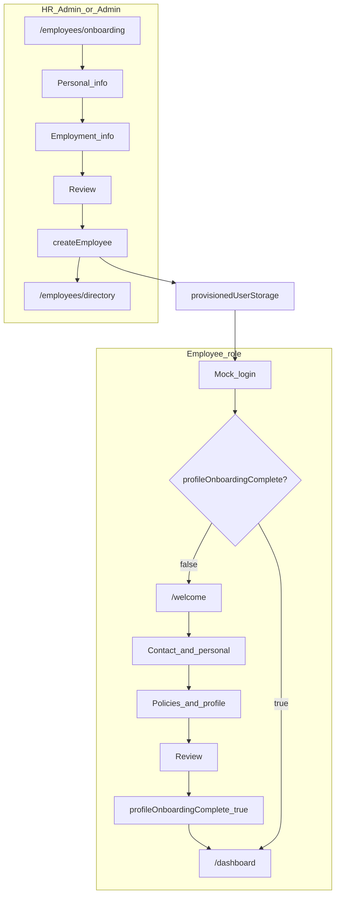

# Employee onboarding (TitoHRIS Phase 1)

This document describes **what the template implements today** and **what is planned for a later phase**. For routes, roles, and demo accounts, see [readme.md](../readme.md).

## Overview

Onboarding is **two connected flows**:

1. **HR admin hub** — HR Admin or Admin starts/resumes HR drafts, submits the wizard, and monitors **all directory employees** in a status table at `/employees/onboarding`.
2. **Employee welcome** — After HR create, the hire signs in with their **work email** (mock-provisioned) and completes `/welcome` before the app shell.

**Mock constraints (Phase 1):**

- Employee records live in an in-memory store ([`employeeStore.ts`](../src/lib/mock/employeeStore.ts)); data resets on page refresh.
- Auth users (`AuthUser`) and HR records (`Employee`) are **separate**. Creating an employee does **not** create a login, send email, or assign a portal role.
- Session is stored in `localStorage` (`titohris-auth-session`).

---

## Implemented today

### Routes and access

| Track | Path | Who | Permission / guard |
|-------|------|-----|-------------------|
| HR create employee | `/employees/onboarding` | HR Admin, Admin | `employees.create` ([`routeGuards.ts`](../src/features/auth/routeGuards.ts)) |
| Employee welcome | `/welcome` | Employee (linked record) | [`needsEmployeeWelcomeOnboarding`](../src/features/employee-welcome/lib/profileOnboardingPolicy.ts); app shell blocked by [`requireEmployeeWelcomeComplete`](../src/features/employee-welcome/routeGuards.ts) |

**Billing:** Creating an employee requires the `employee_onboarding` plan feature and an available seat ([`employeeApi.ts`](../src/features/employees/api/employeeApi.ts)).

### 1. HR admin hub and wizard (`/employees/onboarding`)

**Hub (default):** [`OnboardingHub.tsx`](../src/features/onboarding/components/OnboardingHub.tsx) + [`OnboardingStatusTable.tsx`](../src/features/onboarding/components/OnboardingStatusTable.tsx)

- **Start onboarding** — creates an org-scoped draft in `localStorage` (`titohris-onboarding-drafts`).
- **Status table** — all directory employees plus HR drafts; columns: HR setup, Employee welcome, updated, actions.
- **Filters:** All | Needs attention | Complete ([`onboardingStatus.ts`](../src/features/onboarding/lib/onboardingStatus.ts)).

**Wizard:** [`OnboardingWizard.tsx`](../src/features/onboarding/components/OnboardingWizard.tsx) (opened from hub; `key={draftId}` remount per draft)

**Steps** ([`onboardingSteps.ts`](../src/features/onboarding/lib/onboardingSteps.ts)):

| Step | Component | Purpose |
|------|-----------|---------|
| 1 Personal | [`PersonalInfoStep.tsx`](../src/features/onboarding/components/PersonalInfoStep.tsx) | Identity, contact, photo |
| 2 Employment | [`EmploymentInfoStep.tsx`](../src/features/onboarding/components/EmploymentInfoStep.tsx) | Role, department, dates, branch |
| 3 Review | [`ReviewStep.tsx`](../src/features/onboarding/components/ReviewStep.tsx) | Confirm and submit |

**Validation:** [`onboardingSchema.ts`](../src/features/onboarding/schemas/onboardingSchema.ts)

**Fields collected:**

- **Personal:** `employeeId` (auto-suggested via [`suggestEmployeeId()`](../src/features/employees/api/employeeApi.ts)), `firstName`, `lastName`, optional demographics (`dateOfBirth`, `gender`, `nationality`, `maritalStatus`), `email`, `phone`, optional `address`, optional `photoUrl`
- **Employment:** `department` (or `departmentOther` if Other), `position`, optional `managerId`, `employmentType` (`full-time` | `internship` | `contract`), `hireDate`, optional `probationEndDate`, contract dates when type is contract/internship, `officeBranch`

**On submit:** `createEmployee()` writes the record with `status: "active"` and `profileOnboardingComplete: false`, provisions mock portal access ([`provisionedUserStorage.ts`](../src/features/auth/provisionedUserStorage.ts)), removes the draft, and returns to the hub.

**Draft persistence:** Saves on step change and **Save & exit** (`saveDraftQuiet` in wizard; `saveDraft` notifies hub). Survives page refresh via `localStorage`.

**Portal handoff:** New hires log in with the **work email** from the wizard and password ≥ 4 characters (mock). [`mockLogin`](../src/features/auth/authStorage.ts) resolves provisioned users before ad-hoc login. Demo accounts (`@titohris.com`) still take precedence.

### 2. Employee welcome (`/welcome`)

**UI:** [`WelcomeOnboardingPage.tsx`](../src/features/employee-welcome/pages/WelcomeOnboardingPage.tsx) → [`ProfileOnboardingWizard.tsx`](../src/features/employee-welcome/components/ProfileOnboardingWizard.tsx)

**Steps** ([`profileOnboardingSteps.ts`](../src/features/employee-welcome/lib/profileOnboardingSteps.ts)):

| Step | Component | Purpose |
|------|-----------|---------|
| 1 Contact | [`ContactDetailsStep.tsx`](../src/features/employee-welcome/components/ContactDetailsStep.tsx) | Phone (required), optional personal & emergency contact |
| 2 Policies | [`PoliciesStep.tsx`](../src/features/employee-welcome/components/PoliciesStep.tsx) | Handbook & privacy acknowledgements, optional profile extras |
| 3 Review | [`WelcomeReviewStep.tsx`](../src/features/employee-welcome/components/WelcomeReviewStep.tsx) | HR-assigned summary + employee updates |

**Validation:** [`profileOnboardingSchema.ts`](../src/features/employee-welcome/schemas/profileOnboardingSchema.ts)

**On submit:** [`completeProfileOnboarding()`](../src/features/employee-welcome/api/profileOnboardingApi.ts) updates the linked employee, sets `profileOnboardingComplete: true`, records audit event `onboarding.completed`, then redirects to `/dashboard`.

**Access gate:** Full dashboard and app shell are available only after the employee completes welcome—not after an admin “marks complete.”

### Demo accounts

| Scenario | Login | Employee record |
|----------|-------|-----------------|
| HR creates employees | `hr@titohris.com` / `titohris` | Citra (`EMP-003`) |
| New hire must complete welcome | `newhire@titohris.com` / `titohris` | `EMP-011`, `profileOnboardingComplete: false` |
| Welcome already done | `employee@titohris.com` / `titohris` | Angela (`EMP-001`), welcome skipped |

### How to verify

1. Sign in as HR → **Employees → Onboarding** → status table shows all employees + drafts → **Start onboarding** → complete wizard → hub shows HR Complete / Employee Pending for new hire.
2. Log out → sign in with the new hire **work email** + `titohris` → `/welcome` → complete → Employee Complete in table.
3. `newhire@titohris.com` demo still forces welcome (pre-seeded account).
4. HR dashboard quick action badge uses live `needsAttentionCount` (drafts + pending welcome).

---

## Not implemented in Phase 1

The following appear in product discussions but **do not exist** in this template:

| Capability | Status |
|------------|--------|
| Assign portal role / workspace on create | Partial — mock `employee` role via work email only |
| Invite email with login link | Not built |
| Admin “waiting for accept” state | Not built |
| Admin monitor task checklist / reminders | Not built — status table covers HR/welcome badges only |
| Admin “mark onboarding complete” | Not built — employee self-completes welcome |
| Configurable onboarding task templates | Not built — fixed policy checkboxes only |
| Government ID / document upload (HR wizard) | Not built |
| Training modules | Not built |
| Real-time task status handoff (employee → admin) | Not built |

---

## Future / Phase 2 (target product flow)

The sections below describe a **target** multi-step HRIS onboarding (invites, RBAC provisioning, admin oversight). Use this as a roadmap when extending beyond the mock template.

### Admin side (planned)

1. **Create employee profile** — Partially covered today by the HR wizard; future: optional draft queue and persistence across sessions.
2. **Assign role and access** — Create or link `AuthUser`, assign workspace role (`employee`, `manager`, `hr_admin`, `admin`), permission flags; auto `is_workspace_admin` when role is admin.
3. **Send onboarding invite** — Email with login link, instructions, optional deadline.
4. **Monitor progress** — Admin view of welcome/task completion; reminders for overdue steps.
5. **Mark onboarding complete** — Optional admin sign-off in addition to employee self-service (if product requires it).

### Employee side (planned)

1. **Accept invite** — Invite link → set password → first login.
2. **Complete personal details** — Extend welcome with document upload if required.
3. **Complete onboarding tasks** — Configurable checklist (policies, forms, training).
4. **Access employee dashboard** — Full access after requirements met (define whether admin approval is required).

### Planned handoffs

| Event | From | To |
|-------|------|-----|
| Invite sent | Admin | Employee |
| Task status update | Employee | Admin (real-time or polled) |
| Onboarding marked complete | Admin or system | Employee (full access) |

### Suggested implementation phases

| Phase | Deliverable |
|-------|-------------|
| 1 | Documentation aligned with code (this file) |
| 2 | Auth provisioning on `createEmployee` (user + role + `employeeId` link) |
| 3 | Invite token + email mock + accept-invite route |
| 4 | Admin queue showing `profileOnboardingComplete` and last activity |
| 5 | Configurable task templates |

---

## Related code

| Area | Path |
|------|------|
| HR hub, drafts, status | `src/features/onboarding/` |
| Employee welcome | `src/features/employee-welcome/` |
| Create employee + provision | `src/features/employees/api/employeeApi.ts`, `src/features/auth/provisionedUserStorage.ts` |
| Permissions | `src/features/auth/permissions.ts` |
